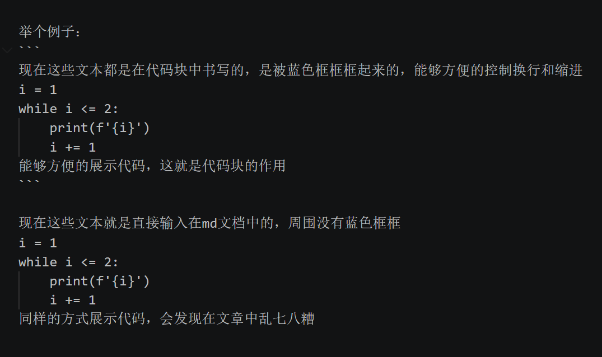

&emsp;&emsp;先介绍一下markdown文档是个什么东西，个人认为算是个极简版的word。在word中所见即所得，需要换行就按回车，可以调整缩进的具体数值，也可以用空格代替缩进，看起来简单（其实调格式也很麻烦😭），但实际上背后是复杂的排版代码。写markdown文档的话就有点像编程，不止是文字需要输入，调整排版需要遵循特殊的语法（所以调格式很轻松😁）。

&emsp;&emsp;现在介绍代码块语法，由于代码是需要遵循严格的换行和缩进的，但是如果将其直接输入到md文档当中会被编译成普通段落文本，失去原本的换行和缩进，这个时候就需要代码块了，在代码块中就能够像在word中写文档一样轻松控制换行和缩进。

举个例子：
```
现在这些文本都是在代码块中书写的，是被蓝色框框框起来的，能够方便的控制换行和缩进
i = 1
while i <= 2:
    print(f'{i}')
    i += 1
能够方便的展示代码，这就是代码块的作用
```

现在这些文本就是直接输入在md文档中的，周围没有蓝色框框
i = 1
while i <= 2:
    print(f'{i}')
    i += 1
同样的方式展示代码，会发现在文章中乱七八糟

下面这张图片就是上面"举个例子"中的所有文字在vscode中的排版



&emsp;&emsp;从图片中可以得知，代码块就是用几个看起来像顿号（因为我不知道这是什么符号😁）包起来的东西，半角状态（英文输入状态）下数字1边上的按键（有个小波浪的按键），不是中文顿号。<br>

最好是把代码块看懂再看以下部分

---

&emsp;&emsp;本篇文章的结构如下:
- md文档中的写法（有个蓝色框框框起来的，利用代码块语法实现）
- 实际在网页呈现出来的效果

&emsp;&emsp;以上两种形式循环，每种大类之间有分隔线<br>

---

```
# 这是一级标题

## 这是二级标题

### 这是三级标题

#### 最多六级标题
```

# 这是一级标题

## 这是二级标题

### 这是三级标题

#### 最多六级标题

---

```
这是普通段落文本，直接输入即可
```

这是普通段落文本，直接输入即可

---

```
**这是加粗文本**

*这是斜体文本*

~~这是删除线文本~~
```

**这是加粗文本**

*这是斜体文本*

~~这是删除线文本~~

---

```
`这是行内代码`
```

`这是行内代码`

---

```
> 这是引用文本
- 这是无序列表项
1. 这是有序列表项
```

> 这是引用文本
- 这是无序列表项
1. 这是有序列表项

---

文字链接
```
[markdown官网](https://markdown.com.cn/basic-syntax/)
```

[markdown官网](https://markdown.com.cn/basic-syntax/)

---

插入图片（更多内容查看图片演示文档）
```

```


---

表格
```
| 表头1 | 表头2 |
|-------|-------|
| 单元格 | 单元格 |
```

| 表头1 | 表头2 |
|-------|-------|
| 单元格 | 单元格 |

---

分隔线，文章中的蓝色线条就是水平分隔线
```
---
```
```
***
```